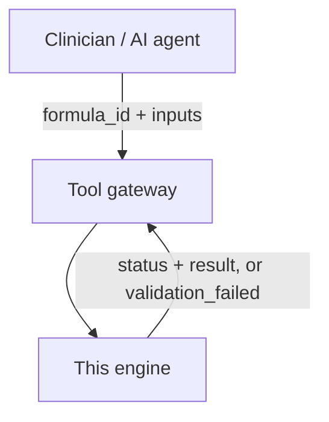
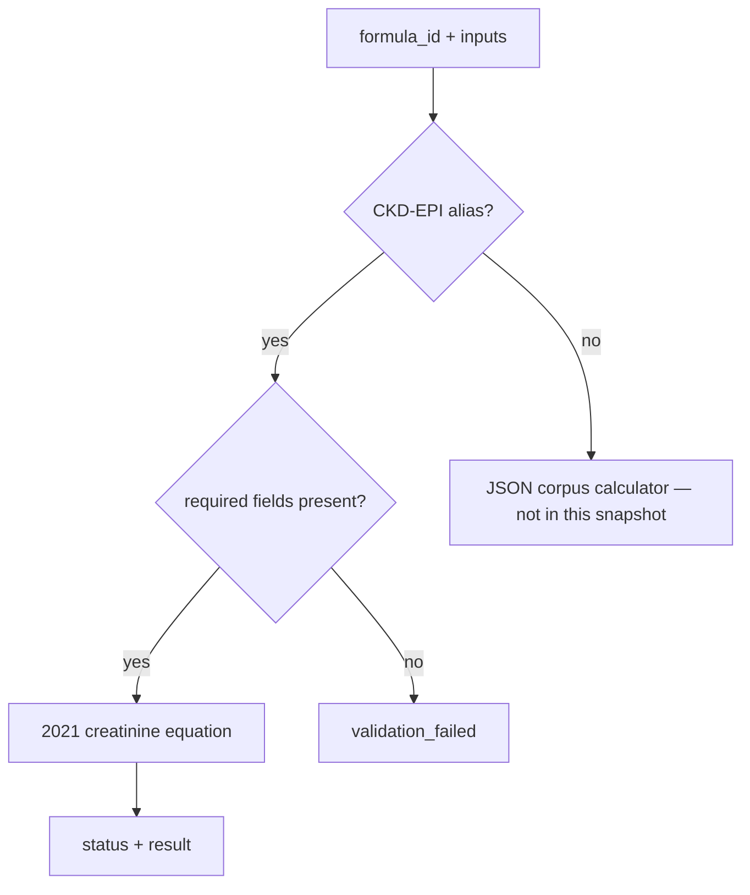
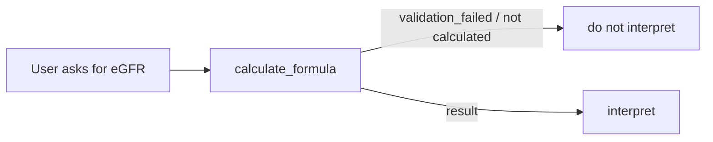
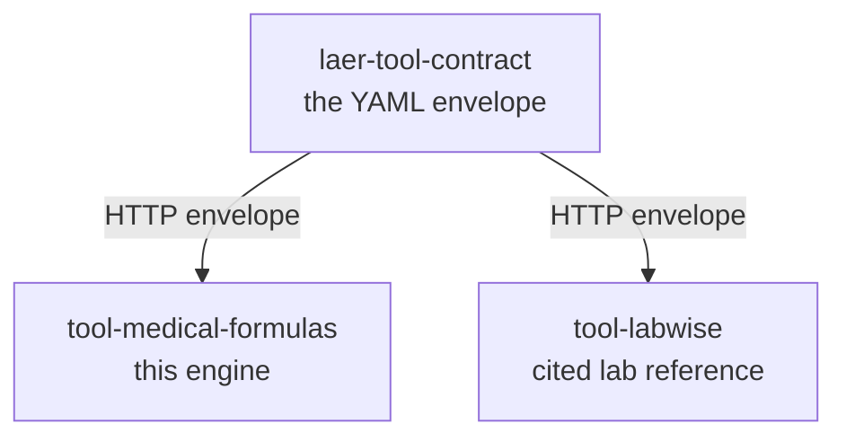

# tool-medical-formulas

**A clinical score the model is not allowed to invent.**

When a clinician asks for eGFR, MELD, or CHA₂DS₂-VASc, a language model can produce a plausible number without doing the arithmetic. That number can then be interpreted, charted, and acted on. This repository is the engine that makes the number come from code instead.

Related contract (how the tool is declared to the platform): [laer-tool-contract](https://github.com/Sankytanky100/laer-tool-contract). Sibling tool (cited lab reference): [tool-labwise](https://github.com/Sankytanky100/tool-labwise).

---

## The problem

Clinical calculators look like a natural job for an assistant: take age, sex, creatinine; return eGFR. If the assistant *guesses*, three things go wrong at once.

1. **The arithmetic is unchecked.** CKD-EPI 2021 is a specific equation (Inker et al., race-free). A model paraphrase is not that equation.
2. **Missing inputs get filled in.** No creatinine should mean *no score*, not a confident 62.
3. **Interpretation detaches from calculation.** "This eGFR is reassuring" is unsafe if no eGFR was computed.

The usual fix is another small service per score. Do that for a catalog of scores and the equation, the units, and the refusal rules drift independently.

## The idea

Put the arithmetic in a deterministic engine. The assistant may choose *which* formula and gather inputs. **Code computes.** If a required input is missing, the engine returns `validation_failed` — it does not invent a result.

CKD-EPI is a coded special case in this snapshot, so you can run it with no formula JSON on disk.



---

## What it actually looks like

This is a real call from this tree (2026-09-09). Inputs are synthetic adult values, not a patient record.

```python
from tool_medical_formulas.native_ops import execute_native

await execute_native(
    "calculate_formula",
    {
        "formula_id": "ckd_epi",
        "inputs": {"age": 68, "sex": "female", "creatinine": 1.8},
    },
    {},
)
```

Returned:

```json
{
  "status": "success",
  "result": 30.3,
  "units": "mL/min/1.73m2",
  "formula_id": "ckd-epi-equations-for-glomerular-filtration-rate-gfr",
  "validated_inputs": {
    "age": 68.0,
    "sex": "female",
    "creatinine": 1.8,
    "equation": "2021 CKD-EPI Creatinine"
  },
  "provenance": {
    "deterministic": true,
    "engine": "ckd_epi_2021_creatinine",
    "guideline": "Inker et al. 2021 (race-free)"
  }
}
```

Same call with creatinine omitted:

```json
{
  "status": "validation_failed",
  "error": "missing_required_inputs",
  "missing_fields": ["creatinine"]
}
```

The engine does not guess 30.3 without Scr. More captured pairs: [`docs/EXAMPLES.md`](docs/EXAMPLES.md).



---

## Calculate first

This snapshot's slim surface implements **two** operations: `calculate_formula` and `compute_medical_formula`. Asking it to interpret without a calculation is not implemented:

```
RuntimeError: operation_not_available_in_slim_mode:interpret_medical_formula_result
```

That is deliberate. Other operation ids exist on the full contract (`identify_medical_formulas`, `interpret_medical_formula_result`, …). They are not silently faked here.



Stale-lab **hard_block** (creatinine older than 14 days) lives on the **contract** (`medical_formulas.http.yaml` in [laer-tool-contract](https://github.com/Sankytanky100/laer-tool-contract)), not in this Python. This engine answers "was the arithmetic done?"; the gateway answers "were the labs fresh enough to ask?"

---

## Try it

Python 3.11+:

```bash
python -m pip install -e ".[slim]" pytest pytest-asyncio
python -c "from tool_medical_formulas.engine.ckd_epi_creatinine import ckd_epi_2021_creatinine_egfr; print(ckd_epi_2021_creatinine_egfr(age_years=68, female=True, creatinine_mg_dl=1.8))"
python -m pytest -q
```

Expected print: `30.3`

Expected tests: the CKD-EPI and slim native-op suite. TAP / TSE / monorepo tests are ignored in this snapshot — they need a private platform package that is not on PyPI.

---

## What's in here

| Path | Role |
|---|---|
| `src/tool_medical_formulas/engine/ckd_epi_creatinine.py` | 2021 CKD-EPI creatinine eGFR (no corpus) |
| `src/tool_medical_formulas/native_ops.py` | Slim `calculate_formula` / `compute_medical_formula` |
| `src/tool_medical_formulas/engine/` | Parser, compiler, deterministic calculator, unit conversion |
| `docs/EXAMPLES.md` | Request/response pairs **captured from this tree** |
| `docs/diagrams/` | Calculate-path diagram (Mermaid + SVG) |

The JSON formula corpus used in production is **not committed** (licence unconfirmed for a public snapshot). Without it, non-CKD-EPI `calculate_formula` has nothing to compile.

The FastAPI HTTP server (`main.py`) talks to a private `laer-platform` package. That extra is declared but **not installable from public PyPI**. The engine above does not need it.



---

## Glossary

| Term | Meaning |
|---|---|
| **eGFR** | Estimated glomerular filtration rate (mL/min/1.73m²) |
| **CKD-EPI 2021** | Race-free creatinine equation (Inker et al.) used here |
| **formula_id** | Which score to run (`ckd_epi` is an alias) |
| **slim** | This snapshot's native surface: calculate only |
| **hard_block** | Contract rule: too-old required labs refuse the call *before* compute |
| **PHI** | Protected Health Information — this tool is built not to need it |

---

## About this snapshot

This is a **public snapshot of an internal tool**, published to show the engine.

- Live Cloud Run hosts, GCP project ids, and deploy workflows are omitted.
- Production TSE hash pins are omitted.
- TAP (form-building LLM) source is present but not exercised in the public test run.
- `txagent` is not this repo. Clinical calculation here is original; it is not Harvard TxAgent.

## Licence

Apache-2.0. See [`LICENSE`](LICENSE) and [`NOTICE`](NOTICE).
